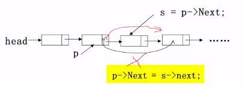
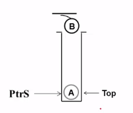
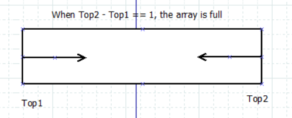
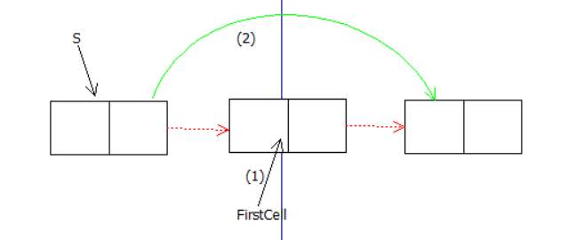

[TOC]


# DATA STRUCTURE

***An example to explain data structure and algorithm:***


```
How do you find a specific book from a library?

Method #1: You could check each book by shelves, one by one, first to last, until you find the book in question.
Method #2: You could first locate the bookshelf according to the category of the book in question. You determine whether the subject is the humanities, science, computer science and so on, and then you search only that specific bookshelf.
Each of these methods are algorithms. This is the definition of an algorithm: a method for solving a problem which can be implemented via programming.

In this analogy, the books, the shelves, and the way they are arranged are all data structures.
FROM: geeksforgeeks
```


## 线性结构

### 1. 线性表

由同类型`数据元素`构成`有序序列`的线性结构。

- 线性表`长度`：表中元素个数
- `空表`：线性表中无元素
- `表头`/`表尾`

#### （1）线性表的顺序存储

利用数组的`连续存储空间顺序存放`线性表的各元素。

```c++
typedef  struct LNode *List;
struct LNode{
    ElementType Data[MAXSIZE];
    int last;  // 指向数组最后一个元素
};
struct LNode L;
List PtrL;

// 访问下标为i的元素：L.Data[i], PtrL->Data[i]
// 线性表长度：L.last+1, PtrL->last+1
```

**主要操作的实现**

- 初始化

```c++
List MakeEmpty(){
    List PtrL;
    PtrL = (List)malloc(sizeof(struct LNode));  // 申请结构
    PtrL->last = -1;  // 置空
    return PtrL;
}
```

- 查找

```c++
// 查找变量X位置
int Find(ElementType X, List PtrL){
    int i = 0;
    while(i <= PtrL->last && PtrL->Data[i] != X) // 两种退出情况
        i++;
    if(i > PtrL->last) return -1; // 未找到
    else return i;  // 找到，返回位置
}
```

查找平均次数为`(n+1)/2`，`O(n)`。  // 运气好，第一个就找到；运气不好，最后一个找到。

- 插入

  > 在第`i`（1<i<n+1)个位置上插入值为X的元素

  将`i-1`之后的元素（包含i-1)移动后一位，再进行插入

  从后往前挪动。

```c++
void Insert(ElementType X, int i, List PtrL){
    int j;
    if(PtrL->last == MAXSIZE-1){  // 表空间已满，不能插入
        printf("表满");
        return;
    }
    if(i < 1 || i > PtrL->last+2){
        printf("位置不合法");
        return;
    }
    for(j = PtrL->last; j >= i-1; j--)  // 移动元素
        PtrL->Data[j+1] = PtrL->Data[j];
    PtrL->Data[i-1] = X;  // 插入元素
    PtrL->last++;  // last仍指向最后元素
    return;
}
```

平均移动次数`n/2`，`O(n)`。

- 删除

  删除表第`i`(1<i<n)个位置上的元素。

```c++
void Delete(int i, List PtrL){
    int j;
    if(i < 1 || i > PtrL->last+1){  // 检查删除位置合法性
        printf("不存在第%d个元素", i);
        return;
    }
    for(j = i; j <= PtrL->last; j++)
        PtrL->Data[j-1] = PtrL->Data[j];
    PtrL->last--; 
    return;
}
```

平均移动次数`(n-1)/2`，`O(n)`。

#### （2）线性表的链式存储

> 不要求逻辑上相邻的两个元素物理上也相邻。
>
> - 插入、删除不需移动元素


```c++
typedef struct LNode *List;
struct LNode{
    ElementType Data;  // 数据域
    List Next;  // 指针域
};
struct LNode L;
List PtrL;
```

**主要操作**

- 求表长

```c++
// 遍历整个链表
int Length(List PtrL){
    List p = PtrL;  // 设指针p指向链表的头
    int j = 0;
    while(p){
        p = p->Next;
        j++;
    }
    return j;
}
```

`O(n)`

- 查找

```c++
// (1)按序号查找
List FindKth(int K, List PtrL){
    List p = PtrL;
    int i = 1; // 一开始p指向第一个元素 
    while(p != NULL && i < K){ // 退出条件：p == NULL or i == k
        p = p->Next;
        i++;
    }
    if(i == K) return p;
    else return NULL;
}
```

```c++
// (2)按值查找
List Find(ElementType X, List PtrL){
    List p = PtrL;
    while(p != NULL && p->Data != X)
        p = p->Next;
    return p;
}
```

`O(n)`

- 插入

  > 在第$i-1（1\leq i\leq n+1)$ 个结点后插入值为X的新结点

  （1）先构造一个新结点，用s指向；

  （2）找到链表第$i-1$个结点，用p指向；

  （3）修改指针，插入结点

  

```c++
List Insert(ElementType X, int i, List PtrL){
    List p, s;
    if(i == 1){  // 插在链表头上，做特殊处理
        s = (List)malloc(sizeof(struct LNode)); // 申请结点
        s->Data = X;
        s->Next = PtrL;
        return s;  // 返回新表头指针
    }
    p = FindKth(i-1, PtrL);  // 查找第i-1个结点
    if(p == NULL){           // 若不存在，则不能插入
        printf("参数i错");
        return NULL;
    } else {                 // 存在，申请新结点
        s = (List)malloc(sizeof(struct LNode));
        s->Data = X;
        s-Next = p->Next;
        p->Next = s;
        return PtrL;
    }
}
```

- 删除

  > 删除链表第$i(1\leq i \leq n)$个位置上的结点

  （1）先找到链表第$i-1$个结点，用p指向；

  （2）再用指针s指向被删除结点

  （3）修改指针，删除s所指结点

  （4）*释放s所指结点空间*

  

  

```c++
List Delete(int i, List PtrL){
    List p, s;
    if(i == 1){  // 删除表第一个结点
        s = PtrL;  // s指向第一个结点
        if(PtrL != NULL) 
            PtrL = PtrL->Next;
        else  // 删除时链表为空
            return NULL;
        free(s);
        return PtrL;
    }
    p = FindKth(i-1, PtrL);  // 找到被删除结点的前一个结点
    if(P == NULL){
        printf("第%d个结点不存在", i-1);
        return NULL;
    }
    else if(p->Next == NULL){
        printf("第%d个结点不存在", i);
        return NULL;
    }
    else{
        s = p->Next;
        p->Next = s->Next;
        free(s);
        return PtrL;
    }
}
```

`n/2`

#### （3）广义表和多重链表

`广义表`(Generalized List)

- 线性表的推广
- 对于广义表而言，n个元素都是基本的单元素

```c++
typedef struct GNode *GList;
struct GNode{
    int Tag;  // 标志域：0表示结点为单元素，1表示结点是广义表
    union{  // Data与subList共用内存
        ElementType Data;
        GList SubList;
    }URegion;
    GList Next; 
};
```


`多重链表`：链表中的节点可能同时隶属于多个链

- 多重链表中结点的**指针域会有多个**
- 但包含两个指针域的链表并不一定是多重链表（双向链表不是多重链表）

应用：存储矩阵、十字链表


### 2. 堆栈

#### （1）堆栈

eg. 计算机求值，符号优先级

中缀表达式：运算符号位于两个运算数之间。（$a+b*c$）

后缀表达式：运算符号位于两个运算数之后。($a\;b\; c\; *\;+$)

- 遇到运算数：记住还不参与运算的数字。
- 遇到运算符号：找出对应的运算数，进行计算。

`堆栈(stack)`：只在一端（栈顶）做插入、删除的线性表

- 后入先出(LIFO)

#### （2）栈的顺序存储实现

由一个`一维数组`和一个记录`栈顶`元素位置的变量组成。

```c++
#define MaxSize <存储数据元素的最大个数>
typedef struct SNode *Stack;
struct SNode{
    ElementType Data[MaxSize];
    int Top;
};
```

- 入栈

```c++
void Push(Stack PtrS, ElementType item){
    if(PtrS->Top == MaxSize-1){
        printf("栈满");
        return;
    } else {
        PtrS->Data[++(PtrS->Top)] = item;
        return;
    }
}
```



- 出栈

```c++
ElementType Pop(Stack PtrS){
    if(PtrS->Top == -1){
        printf("栈空");
        return ERROR;  // 预先定义标志值
    } else
        return (PtrS->Data[(PtrS->Top)--]);	
}
```

eg. 使用一个数组实现两个堆栈，最大利用数组空间。

>  从两头开始，相遇即满。



```c++
#define MaxSize <存储数据元素的最大个数>
struct DStack{
    ElementType Data[MaxSize];
    int Top1;
    int Top2;
}S;
// S.Top1 == -1;  栈1空
// S.Top2 == MaxSize;  栈2空
```

> Push

```c++
void Push(struct DStack *PtrS, ElementType item, int Tag){
    // Tag: 区分两个栈的标志。取值为1或2。
    if(PtrS->Top2 - PtrS->Top1 == 1){
        // 栈满
        printf("栈满");
        return;
    } 
    if(Tag == 1)  // 对第一个栈操作
        PtrS->Data[++(PtrS->Top1)] = item;
    else          // 对第二个栈操作
        PtrS->Data[--(PtrS->Top2)] = item;
}
```

> Pop

```c++
ElementType Pop(struct DStack *PtrS, int Tag){
    if(Tag == 1){
        if(PtrS->Top1 == -1){
            printf("栈1空");
            retutn NULL;
        } else 
            return PtrS->Data[(PtrS->Top1)--];
    } else {
        if(PtrS->Top2 == MaxSize){
            printf("栈2空");
            return NULL;
        } else
            return PtrS->Data[(PtrS->Top2)++];
    }
}
```

#### （4）堆栈的链式存储实现

> 实际上是`单链表`，称为`链栈`。


**栈顶指针Top一定是在链表的头上！！！**

```c++
typedef struct SNode *Stack;
struct SNode{
    ElementType Data;
    struct SNode *Next;
}
```

```c++
Stack CreateStack(){
    // 构建一个堆栈的头结点，并返回指针。
    Stack S;
    S = (Stack)malloc(sizeof(struct SNode));
    S->Next = NULL;
    return S;
}

```


```c++
// 判别堆栈是否为空
int IsEmpty(Stack S){
    // 为空：返回1；否则返回0
    return (S->Next == NULL);
}
```

> Push

```c++
void Push(ElementType item, Stack S){
    struct SNode *TmpCell;
    TmpCell = (struct SNode *)malloc(sizeof(struct SNode));
    TmpCell->Element = item;
    TmpCell->Next = S->Next;
    S->Next = TmpCell;
}
```


> Pop

```c++
// 删除并返回栈顶元素
ElementType Pop(Stack S){
    struct SNode *FirstCell;
    if(IsEmpty(S)){
        printf("栈空");
        return NULL;
    } else {
        FirstCell = S->Next;
        S->Next = FirstCell->Next;
        TopElem = FirstCell->Element;
        free(FirstCell);
        return TopElem;
    }
}
```




#### (5)堆栈应用：表达式求值

> 中缀表达式求值

基本策略：将中缀表达式转换成后缀表达式，然后求值。


**有括号的例子**

> 转换方法（中缀->后缀）

运算数：直接输出

左括号：压入堆栈

右括号：将栈顶的运算符弹出并输出，直到遇到右括号（出栈，不输出）

运算符：

 - 若优先级大于栈顶运算符时，压入堆栈；

 - 若优先级小于栈顶运算符时，栈顶运算符弹出并输出；

   比较新的栈顶运算符，直到该运算符大于栈顶运算符优先级为止，然后压入堆栈。

各对象处理完毕，将堆栈中存留的运算符逐一输出。


### 3. 队列

#### （1）队列及顺序存储实现

> 队列：具有一定操作约束的线性表
>
> - 只能在一端插入(rear+1)，在另一端删除(front+1)。
> - FIFO 

- 队列顺序存储实现

  - 一维数组
  - 记录队列头的元素位置变量`front`
  - 记录队列尾元素位置变量`rear`

  ```c++
  #define MaxSize <存储数据元素的最大个数>
  struct QNode{
      ElementType Data[MaxSize];
      int rear;
      int front;
  };
  typedef struct QNode *Queue;
  ```

- 循环队列

#### （2）队列链式存储实现


### 4. 树（《算法笔记》）

#### 4.1 树与二叉树

##### 4.1.1 树的定义与性质

- 树(Tree)
  - `结点`(node)
    - 树枝分叉处
    - 树叶：`子结点`leaf
    - 树根：`根节点`root
  - `边`(edge)：茎干/树枝
- 性质
  - `空树`(empty tree)：树没有结点
  - 树的`层次`(layer)：从根节点开始算起，根节点为第一层
  - 结点的`度`(degree)：结点的子树数
  - 树的`度`：树中结点最大的度
  - 对有**n**个结点的树，边数一定是**n-1**。且==满足连通，边数等于顶点数-1的结构一定是一棵树==
  - `森林`(forest)：若干棵树的集合

##### 4.1.2 二叉树的递归定义

> 二叉树与度为2的树的区别：二叉树左右子树是严格区分的。

`递归定义`：

- 要么二叉树没有根节点，是一颗空树。
- 要么二叉树由根节点左子树/右子树组成，且左子树和右子树都是二叉树。

两种特殊的二叉树：

- `满二叉树`：每一层结点个数达到当层达到的最大结点树
- `完全二叉树`：除了最下面一层外，其余层结点个数达到当层达到的最大个数，且最下面一层只从左至右连续存在若干结点，连续结点的右边结点不存在。

##### 4.1.3 二叉树的存储结构与基本操作

- 二叉树的存储结构

  二叉链表定义方式：

  ```c++
  struct node {
      typename data;
      node *lchild;
      node *rchild;
  };
  ```

  由于在建树前根节点不存在

  ```c++
  node *root = NULL;
  ```

  ```c++
  // 生成一个新结点，结点权值为v
  node *newNode(int y) {
      node *Node = new node;
      Node->data = v;
      Node->lchild = Node->rchild = NULL;  // 初始状态下没有左右孩子
      return Node;  // 返回新结点地址
  }
  ```

- 二叉树结点的查找/修改

  ==递归式==：对当前结点的左子树和右子树分别递归。

  ==递归边界==：当前结点为空时到达死胡同。

  ```c++
  void search(node *root, int x, int newdata) {
      if(root == NULL)
          return;  // 空树，死胡同（递归边界）
      if(root->data == x)
          root->data = newdata;
      search(root->lchild, x, newdata);  
      search(root->rchild, x, newdata);
  }
  ```

- 二叉树结点的插入

  ```c++
  void insert(node *&root, int x) {
      if(root == NULL) {  // 空树，说明查找失败，也即插入位置（递归边界）
          root = newNode(x);
          return;
      }
      if() 
          insert(root->lchild, x);
      else
          insert(root->rchild, x);
  }
  ```

  

- 二叉树的创建

  ```c++
  node *Create(int data[], int n) {
      node *root = NULL;  // 新建空根节点root
      for(int i = 0; i < n; i++) {
          insert(root, data[i]);
      }
      return root;
  }
  ```

- ==注意`root == NULL`与`*root == NULL`的区别==

  结点不存在与结点存在但没有内容的区别。


#### 4.2 二叉树的遍历

##### 4.2.0 搜索

- 深度优先搜索(**D**epth **F**irst **S**earch)

  

- 广度优先搜索(BFS)

##### 4.2.1 先序遍历(==root==->left->right)

- 实现

  ```c++
  // preorder
  void preorder(node *root) {
      if(root == NULL) {
          return;  // 空树（递归边界）
      }
      // (递归式)
      // 访问根结点
      pirntf("%d\n", root->data); // 这里的输出只是一个示例，你也可以进行其他操作
      // 访问左子树
      preorder(root->lchild);
      // 访问右子树
      preorder(root->rchild);
  }
  ```

- 性质

  先序遍历序列的第一个一定是根结点。

##### 4.2.2 中序遍历(left->==root==->right)

- 实现

  ```c++
  // inorder
  void inorder(node *root) {
      if(root == NULL) {
          return;  // 空树（递归边界）
      }
      // (递归式)
      // 访问左子树
      inorder(root->lchild);
      // 访问根结点
      printf("%d\n", root->data);
      // 访问右结点
      inorder(root->rchild);
  }
  ```

- 性质

  可以根据根结点区分出左子树和右子树。

##### 4.2.3 后序遍历(left->right->==root==)

- 实现

  ```c++
  // postorder
  void postorder(node *root) {
      if(root == NULL) {
          return;  // 空树（递归边界）
      }
      // (递归式)
      // 访问左子树
      postorder(root->lchild);
      // 访问右结点
      postorder(root->rchild);
      // 访问根结点
      printf("%d\n", root->data);
  }
  ```

- 性质

  序列的最后一个一定是根结点。

  > 必须知道中序遍历序列才能确定一棵树。

##### 4.2.4 层序遍历

```c++
// Layerorder
void LayerOrder(node *root) {
    queue<node*> q;  // 队列中存储的是地址
    q.push(root); // (1)将跟结点地址入队
    while(!q.empty()) {
        node* now = q.front();  // (2)取出队首元素
        q.pop();
        printf("%d", now->data);  // (2)访问队首元素
        if(now->lchild != NULL) q.push(now->lchild); // (3)左子树进队
        if(now->rchild != NULL) q.push(now->rchild); // (4)右子树进队
    } // (5)直到队列为空
}
```

当题目中要求计算结点所在层次

```c++
// 题目中要求计算结点所在层次
struct node{
    int data;
    int layer;
    node* lchild;
    node* rchild;
}
void LayerOrder(node* root) {
    queue<node*> q;
    root->layer = 1;  // 根结点层次为1
    q.push(root);  // (1)将根结点地址入队
    while(!q.empty()) {
        node* now = q.front();  // (2)取出队首元素
        q.pop();
        printf("%d", now.data);  // (2)访问队首元素
        if(now->lchild != NULL) {  // 左孩子不空
            now->lchild->layer = now->layer + 1;
            q.push(now->lchild); // (3)左孩子进队
        }
        if(now->rchild != NULL) {
            now->rchild->layer = now->layer + 1;
            q.push(now->rchild);  // (4)右孩子进队
        }
    }
}
```


##### 应用

给定一颗二叉树的先序遍历序列和中序遍历序列，重建这棵二叉树。

```c++
// 先序序列区间[preL, preR], 中序序列区间[inL, inR]，返回根结点地址
node* create(int preL, int preR, int inL, int inR) {
    if(preL > preR)
        return NULL;  // 先序序列长度<=0时，返回
    node* root = new node;  // 新建根结点，存放二叉树的根结点
    root->data = pre[preL];
    int k;
    for(k = inL; k <= inR; k++) {
        if(in[k] == pre[preL]) {
            break;
        }
    }
    int numLeft = k - inL;  // 左子树的结点个数
    // 返回左子树的根结点地址，赋值给root的左指针
    root->lchild = create(preL+1, preL+numLeft, inL, k-1);
    // 返回右子树的根结点地址，赋值给root的右指针
    root->rchild = create(preL+numLeft+1, preR, k+1, inR);

    return root;
}
```


##### 4.2.5 二叉树的静态实现  

结点node定义：

```c++
struct node {
    typename data;  // 数据域
    int lchild;     // 指针域
    int rchild;     // 指针域
} Node[maxn];  // 结点数组,maxn为结点上限个数
```

```从++
int index = 0;
int newNode(int v) {
    Node[index].data = v;
    Node[index].lchild = -1;
    Node[index].rchild = -1;
    return index++;
}
```

```c++
// 查找
void search(int root, int x, int newdata) {
    if(root == -1)
        return;  // 空树，死胡同（递归边界）
    if(Node[root].data == x)
        Node[root].data = newdata;
    search(Node[root].lchild, x, newdata);  
    search(Node[root].rchild, x, newdata);
}
```

```c++
// 插入
void insert(int &root, int x) {
    if(root == -1) {  // 空树，说明查找失败，也即插入位置（递归边界）
        root = newNode(x);
        return;
    }
    if() 
        insert(Node[root].lchild, x);
    else
        insert(Node[root].rchild, x);
}
```

```c++
// 二叉树的建立
int Create(int data[], int n) {
    int root = -1;  // 新建空根节点root
    for(int i = 0; i < n; i++) {
        insert(root, data[i]);
    }
    return root;
}
```

```c++
// preorder
void preorder(int root) {
    if(root == -1)  // （递归边界）
        retrun;
    // (递归式)
    printf("%d", Node[root].data);
    preorder(root->lchild);
    preorder(root->rchild);
}

// inorder
void inorder(int root) {
    if(root == -1)  // (递归边界)
        return;
    inorder(root->lchild);
    printf("%d", Node[root].data);
    inorder(root->rchild);
}

// postorder
void postorder(int root) {
    if(root == -1) 
        return;
    postorder(root->lchild);
    postorder(root->rchild);
    printf("%d", Node[root].data);
}

// layerorder
void LayerOrder(int root) {
    queue<int> q;  // 存放结点下标
    q.push(root);
    while(!q.empty()) {
        int now = q.front();
        q.pop();
        printf("%d", Node[now].data);  
        if(Node[now].lchild != NULL) q.push(Node[now].lchild);
        if(Node[now].rchild != NULL) q.push(Node[now].rchild);
    }
}
```

#### 4.3 树的遍历

##### 4.3.1 树的静态写法

```c++
// 结构体node定义
struct node {
    typename data;  // 数据域
    int child[maxn];// 指针域，maxn为结点上限个数
} Node[maxn];

// 当结点个数较多时
struct node {
    typename data;
    vector child;
} Node[maxn];

// 新建结点时
int index = 0;
int newNode(int v) {
    Node[index].data = v;
    Node[index].child.clear();  // 清空子结点？？
    return index++;
}
```

##### 4.3.2 树的先根遍历

```c++
/*
       v0
      / |  \
    v1  v2   v3
  /   \       |
 v4     v5    v6
 的先根序列就是v0v1v4v5v2v3v6
 */
void PreOrder(int root) {
    printf("%d ", Node[root].data);  // 访问当前结点
    for(int i = 0; i < Node[root].child.size(); i++) 
        PreOrder(Node[root].child[i]);  // 递归访问root结点的所有子结点
}
```

##### 4.3.3 树的层序遍历

```c++
void LayerOrder(int root) {
    queue<int> Q;
    Q.push(root); 
    while(!Q.empty()) {
        int front = Q.front();
        printf("%d ", Node[front].data);
        Q.pop();
        for(int i = 0; i < Node[front].child.size(); i++) 
            Q.push(Node[front].child[i]);
    }
}

// 需要求解对应的层号
struct node {
    int layer;
    int data;
    vector<int> child;
}

void LayerOrder(int root) {
    queue<int> Q;
    Q.push(root);
    Node[root].layer = 0;
    while(!Q.empty()) {
        int front = Q.front();
        printf("%d ", Node[front].data);
        Q.pop();
        for(int i = 0; i < Node[front].child.size(); i++) {
            int child = Node[front].child.[i];
            Node[child].layer = Node[front].layer + 1;
            Q.push(child); // 将当前结点所有子结点全部入队
        }
    }
}
```

##### 4.3.4 从树的遍历看DFS和BFS


#### 4.4 二叉查找树(BST)

#####  4.4.1 定义

- 递归定义
  1. 要么二叉查找树是一棵空树
  2. 要么二叉查找树是由根结点、左子树、右子树组成，其中左子树和右子树都是二叉查找树，且左子树上所有结点数据域均**小于或等于**根结点数据域，右子树上所有结点数据域均**大于等于**根结点数据域。

##### 4.4.2 基本操作

- 查找

  ```c++
  void search(node* root, int x) {
      if(root == NULL) {  // 空树，查找失败
          printf("search failed.\n");
          return;
      }
      if(x == root->data)
          printf("%d", root->data);
      else if(x < root->data)
          search(root->lchild, x);
      else
          search(root->rchild, x);
  }
  ```

- 插入

  ```c++
  // 插入数据域为x的新结点
  void insert(node* &root, int x) {  // 注意加&
      if(root == NULL) {  // 即插入位置
          root = newNode(x);
          return;
      }
      if(x == root->data) { // 查找成功，即结点已存在，直接返回
          return;
      } else if(x < root->data) {
          insert(root->lchild, x);
      } else {
          insert(root->rchild, x);
      }
  }
  ```

- 二叉查找树的建立

  ```c++
  // BST建立
  node* create(int data[], int n) {
      node* root = NULL;
  	for(int i = 0; i < n; i++) {
  		insert(root, data[i]);
  	}
  	return root;
  }
  ```

- 删除

  ```c++
  // 删除
  // 结点的前驱：比结点权值小的最大结点，即左子树中的最右结点
  // 结点的后继：比结点权值大的最小结点，即右子树中的最左结点
  /*            5
  *            /  \
  *          1      8
  *        /   \   /   \
  *       0     3 6      9
  *           /  \  \
  *          2    4   7
  */
  // 寻找以root为根结点的树中的最大权值结点
  node* findMax(node* root) {
  	while(root->rchild != NULL)
  		root = root->rchild;
  	return root;
  }
  // 寻找以root为根结点的树中的最小权值结点
  node* findMin(node* root) {
  	while(root->lchild != NULL)
  		root = root->lchild;
  	return root;
  }
  void deleteNode(node* &root, int x) {
  	if(root == NULL) return;
  	if(root->data == x) {
  		if(root->lchild == NULL && root->rchild == NULL) {  // 叶子结点直接删除
  			root = NULL;
  		} else if(root->lchild != NULL) {
  			node* pre = findMax(root->lchild);  // root前驱
  			root->data = pre->data;
  			deleteNode(root->lchild, pre->data);
  		} else {
  			node* next = findMin(root->rchild);  // root后继
  			root->data = next->data;
  			deleteNode(root->rchild, next->data);
  		}
  	} else if(root->data > x)
  		deleteNode(root->lchild, x);
  	else
  		deleteNode(root->rchild, x);
  }
  ```

  

##### 4.4.3 性质


## WRONG

1. 写函数参数时忘记写类型
2. 写`retun`时注意看一下前面需要返回的类型


