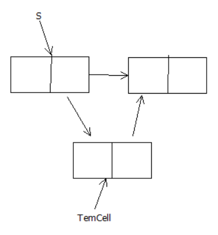

[TOC]


# DATA STRUCTURE

## 线性结构

### 1. 线性表

由同类型`数据元素`构成`有序序列`的线性结构。

- 线性表`长度`：表中元素个数
- `空表`：线性表中无元素
- `表头`/`表尾`

#### （1）线性表的顺序存储

利用数组的`连续存储空间顺序存放`线性表的各元素。

```c++
typedef  struct LNode *List;
struct LNode{
    ElementType Data[MAXSIZE];
    int last;  // 指向数组最后一个元素
};
struct LNode L;
List PtrL;

// 访问下标为i的元素：L.Data[i], PtrL->Data[i]
// 线性表长度：L.last+1, PtrL->last+1
```

**主要操作的实现**

- 初始化

```c++
List MakeEmpty(){
    List PtrL;
    PtrL = (List)malloc(sizeof(struct LNode));  // 申请结构
    PtrL->last = -1;  // 置空
    return PtrL;
}
```

- 查找

```c++
// 查找变量X位置
int Find(ElementType X, List PtrL){
    int i = 0;
    while(i <= PtrL->last && PtrL->Data[i] != X) // 两种退出情况
        i++;
    if(i > PtrL->last) return -1; // 未找到
    else return i;  // 找到，返回位置
}
```

查找平均次数为`(n+1)/2`，`O(n)`。  // 运气好，第一个就找到；运气不好，最后一个找到。

- 插入

  > 在第`i`（1<i<n+1)个位置上插入值为X的元素

  将`i-1`之后的元素（包含i-1)移动后一位，再进行插入

  从后往前挪动。

```c++
void Insert(ElementType X, int i, List PtrL){
    int j;
    if(PtrL->last == MAXSIZE-1){  // 表空间已满，不能插入
        printf("表满");
        return;
    }
    if(i < 1 || i > PtrL->last+2){
        printf("位置不合法");
        return;
    }
    for(j = PtrL->last; j >= i-1; j--)  // 移动元素
        PtrL->Data[j+1] = PtrL->Data[j];
    PtrL->Data[i-1] = X;  // 插入元素
    PtrL->last++;  // last仍指向最后元素
    return;
}
```

平均移动次数`n/2`，`O(n)`。

- 删除

  删除表第`i`(1<i<n)个位置上的元素。

```c++
void Delete(int i, List PtrL){
    int j;
    if(i < 1 || i > PtrL->last+1){  // 检查删除位置合法性
        printf("不存在第%d个元素", i);
        return;
    }
    for(j = i; j <= PtrL->last; j++)
        PtrL->Data[j-1] = PtrL->Data[j];
    PtrL->last--; 
    return;
}
```

平均移动次数`(n-1)/2`，`O(n)`。

#### （2）线性表的链式存储

> 不要求逻辑上相邻的两个元素物理上也相邻。
>
> - 插入、删除不需移动元素


```c++
typedef struct LNode *List;
struct LNode{
    ElementType Data;  // 数据域
    List Next;  // 指针域
};
struct LNode L;
List PtrL;
```

**主要操作**

- 求表长

```c++
// 遍历整个链表
int Length(List PtrL){
    List p = PtrL;  // 设指针p指向链表的头
    int j = 0;
    while(p){
        p = p->Next;
        j++;
    }
    return j;
}
```

`O(n)`

- 查找

```c++
// (1)按序号查找
List FindKth(int K, List PtrL){
    List p = PtrL;
    int i = 1; // 一开始p指向第一个元素 
    while(p != NULL && i < K){ // 退出条件：p == NULL or i == k
        p = p->Next;
        i++;
    }
    if(i == K) return p;
    else return NULL;
}
```

```c++
// (2)按值查找
List Find(ElementType X, List PtrL){
    List p = PtrL;
    while(p != NULL && p->Data != X)
        p = p->Next;
    return p;
}
```

`O(n)`

- 插入

  > 在第$i-1（1\leq i\leq n+1)$ 个结点后插入值为X的新结点

  （1）先构造一个新结点，用s指向；

  （2）找到链表第$i-1$个结点，用p指向；

  （3）修改指针，插入结点

  

```c++
List Insert(ElementType X, int i, List PtrL){
    List p, s;
    if(i == 1){  // 插在链表头上，做特殊处理
        s = (List)malloc(sizeof(struct LNode)); // 申请结点
        s->Data = X;
        s->Next = PtrL;
        return s;  // 返回新表头指针
    }
    p = FindKth(i-1, PtrL);  // 查找第i-1个结点
    if(p == NULL){           // 若不存在，则不能插入
        printf("参数i错");
        return NULL;
    } else {                 // 存在，申请新结点
        s = (List)malloc(sizeof(struct LNode));
        s->Data = X;
        s-Next = p->Next;
        p->Next = s;
        return PtrL;
    }
}
```

- 删除

  > 删除链表第$i(1\leq i \leq n)$个位置上的结点

  （1）先找到链表第$i-1​$个结点，用p指向；

  （2）再用指针s指向被删除结点

  （3）修改指针，删除s所指结点

  （4）*释放s所指结点空间*

  

  

```c++
List Delete(int i, List PtrL){
    List p, s;
    if(i == 1){  // 删除表第一个结点
        s = PtrL;  // s指向第一个结点
        if(PtrL != NULL) 
            PtrL = PtrL->Next;
        else  // 删除时链表为空
            return NULL;
        free(s);
        return PtrL;
    }
    p = FindKth(i-1, PtrL);  // 找到被删除结点的前一个结点
    if(P == NULL){
        printf("第%d个结点不存在", i-1);
        return NULL;
    }
    else if(p->Next == NULL){
        printf("第%d个结点不存在", i);
        return NULL;
    }
    else{
        s = p->Next;
        p->Next = s->Next;
        free(s);
        return PtrL;
    }
}
```

`n/2`

#### （3）广义表和多重链表

`广义表`(Generalized List)

- 线性表的推广
- 对于广义表而言，n个元素都是基本的单元素

```c++
typedef struct GNode *GList;
struct GNode{
    int Tag;  // 标志域：0表示结点为单元素，1表示结点是广义表
    union{  // Data与subList共用内存
        ElementType Data;
        GList SubList;
    }URegion;
    GList Next; 
};
```


`多重链表`：链表中的节点可能同时隶属于多个链

- 多重链表中结点的**指针域会有多个**
- 但包含两个指针域的链表并不一定是多重链表（双向链表不是多重链表）

应用：存储矩阵、十字链表


### 2. 堆栈

#### （1）堆栈

eg. 计算机求值，符号优先级

中缀表达式：运算符号位于两个运算数之间。（$a+b*c​$）

后缀表达式：运算符号位于两个运算数之后。($a\;b\; c\; *\;+$)

- 遇到运算数：记住还不参与运算的数字。
- 遇到运算符号：找出对应的运算数，进行计算。

`堆栈(stack)`：只在一端（栈顶）做插入、删除的线性表

- 后入先出(LIFO)

#### （2）栈的顺序存储实现

由一个`一维数组`和一个记录`栈顶`元素位置的变量组成。

```c++
#define MaxSize <存储数据元素的最大个数>
typedef struct SNode *Stack;
struct SNode{
    ElementType Data[MaxSize];
    int Top;
};
```

- 入栈

```c++
void Push(Stack PtrS, ElementType item){
    if(PtrS->Top == MaxSize-1){
        printf("栈满");
        return;
    } else {
        PtrS->Data[++(PtrS->Top)] = item;
        return;
    }
}
```


- 出栈

```c++
ElementType Pop(Stack PtrS){
    if(PtrS->Top == -1){
        printf("栈空");
        return ERROR;  // 预先定义标志值
    } else
        return (PtrS->Data[(PtrS->Top)--]);	
}
```

eg. 使用一个数组实现两个堆栈，最大利用数组空间。

>  从两头开始，相遇即满。


```c++
#define MaxSize <存储数据元素的最大个数>
struct DStack{
    ElementType Data[MaxSize];
    int Top1;
    int Top2;
}S;
// S.Top1 == -1;  栈1空
// S.Top2 == MaxSize;  栈2空
```

> Push

```c++
void Push(struct DStack *PtrS, ElementType item, int Tag){
    // Tag: 区分两个栈的标志。取值为1或2。
    if(PtrS->Top2 - PtrS->Top1 == 1){
        // 栈满
        printf("栈满");
        return;
    } 
    if(Tag == 1)  // 对第一个栈操作
        PtrS->Data[++(PtrS->Top1)] = item;
    else          // 对第二个栈操作
        PtrS->Data[--(PtrS->Top2)] = item;
}
```

> Pop

```c++
ElementType Pop(struct DStack *PtrS, int Tag){
    if(Tag == 1){
        if(PtrS->Top1 == -1){
            printf("栈1空");
            retutn NULL;
        } else 
            return PtrS->Data[(PtrS->Top1)--];
    } else {
        if(PtrS->Top2 == MaxSize){
            printf("栈2空");
            return NULL;
        } else
            return PtrS->Data[(PtrS->Top2)++];
    }
}
```

#### （4）堆栈的链式存储实现

> 实际上是`单链表`，称为`链栈`。


**栈顶指针Top一定是在链表的头上！！！**

```c++
typedef struct SNode *Stack;
struct SNode{
    ElementType Data;
    struct SNode *Next;
}
```

```c++
Stack CreateStack(){
    // 构建一个堆栈的头结点，并返回指针。
    Stack S;
    S = (Stack)malloc(sizeof(struct SNode));
    S->Next = NULL;
    return S;
}

```


```c++
// 判别堆栈是否为空
int IsEmpty(Stack S){
    // 为空：返回1；否则返回0
    return (S->Next == NULL);
}
```

> Push

```c++
void Push(ElementType item, Stack S){
    struct SNode *TmpCell;
    TmpCell = (struct SNode *)malloc(sizeof(struct SNode));
    TmpCell->Element = item;
    TmpCell->Next = S->Next;
    S->Next = TmpCell;
}
```



> Pop

```c++
// 删除并返回栈顶元素
ElementType Pop(Stack S){
    struct SNode *FirstCell;
    if(IsEmpty(S)){
        printf("栈空");
        return NULL;
    } else {
        FirstCell = S->Next;
        S->Next = FirstCell->Next;
        TopElem = FirstCell->Element;
        free(FirstCell);
        return TopElem;
    }
}
```


#### (5)堆栈应用：表达式求值

> 中缀表达式求值

基本策略：将中缀表达式转换成后缀表达式，然后求值。


**有括号的例子**

> 转换方法（中缀->后缀）

运算数：直接输出

左括号：压入堆栈

右括号：将栈顶的运算符弹出并输出，直到遇到右括号（出栈，不输出）

运算符：

 - 若优先级大于栈顶运算符时，压入堆栈；

 - 若优先级小于栈顶运算符时，栈顶运算符弹出并输出；

   比较新的栈顶运算符，直到该运算符大于栈顶运算符优先级为止，然后压入堆栈。

各对象处理完毕，将堆栈中存留的运算符逐一输出。


### 3. 队列

#### （1）队列及顺序存储实现

> 队列：具有一定操作约束的线性表
>
> - 只能在一端插入(rear+1)，在另一端删除(front+1)。
> - FIFO 

- 队列顺序存储实现

  - 一维数组
  - 记录队列头的元素位置变量`front`
  - 记录队列尾元素位置变量`rear`

  ```c++
  #define MaxSize <存储数据元素的最大个数>
  struct QNode{
      ElementType Data[MaxSize];
      int rear;
      int front;
  };
  typedef struct QNode *Queue;
  ```

- 循环队列


